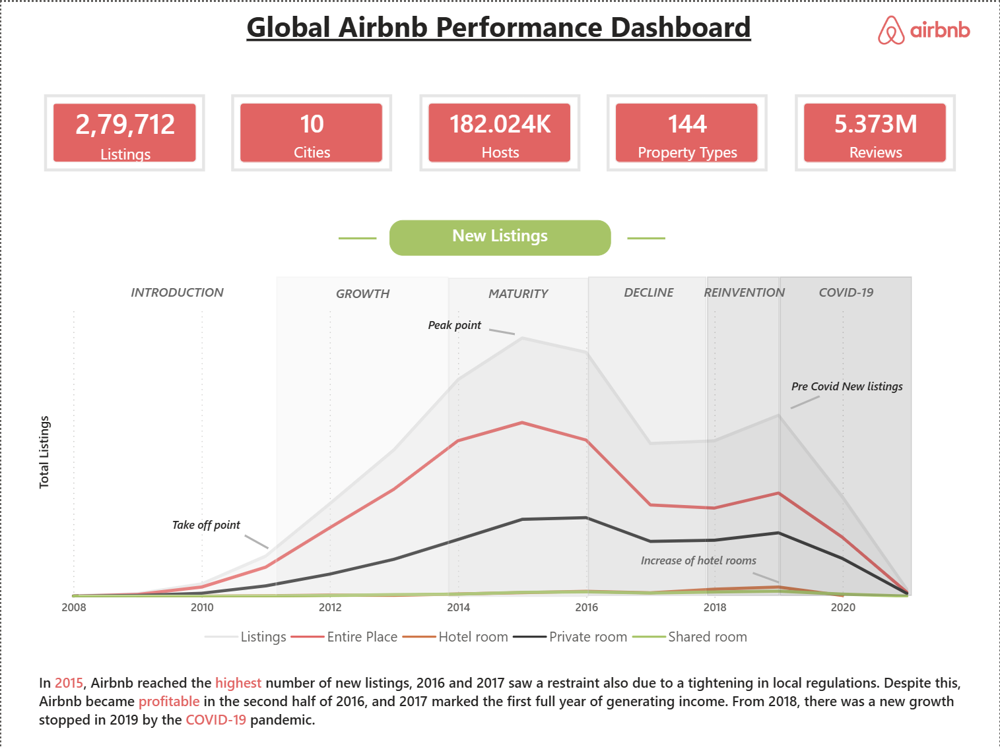
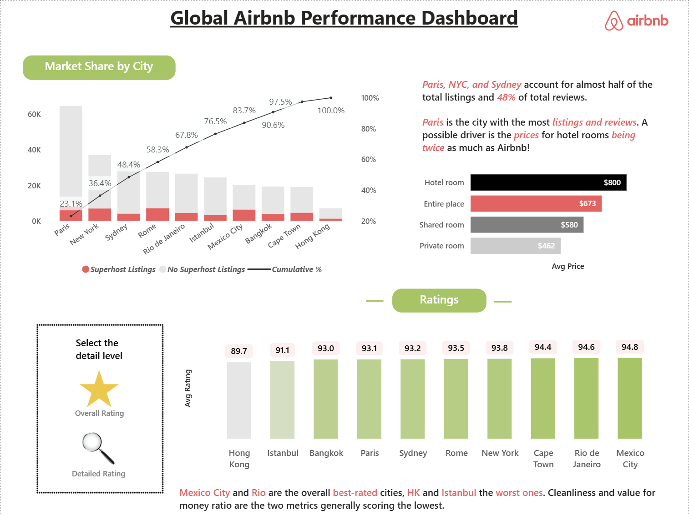
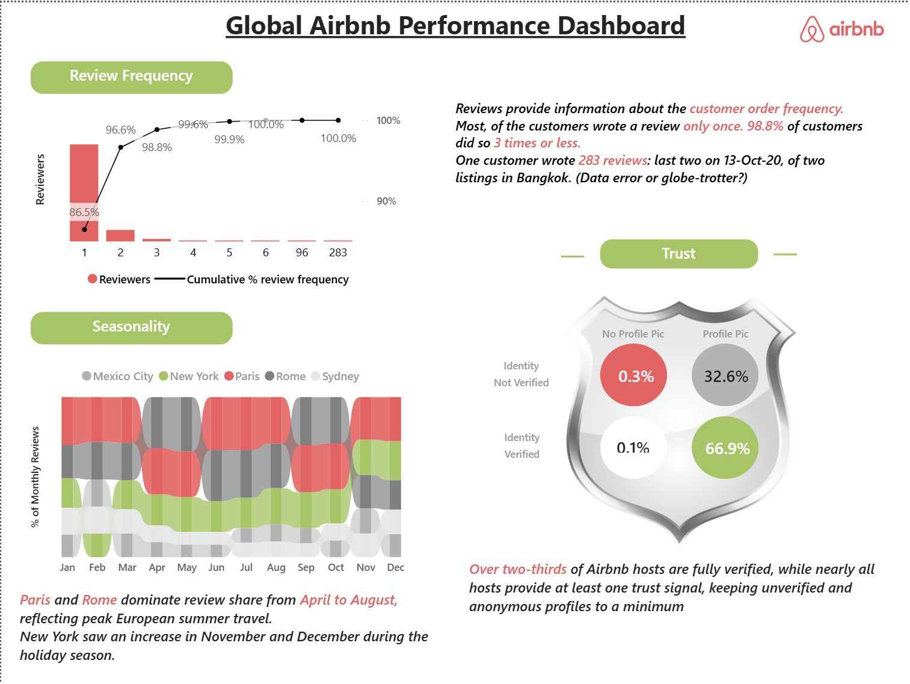

# Global Airbnb Performance Dashboard

## Project Overview

This Power BI project analyzes Airbnb listings, host activity, customer reviews, ratings, and market trends across major global cities. The dashboard provides business insights into listing growth, customer engagement, host trust indicators, pricing patterns, and seasonal review behavior.

The objective of this project is to transform raw Airbnb data into actionable insights using interactive visualizations, KPI tracking, and data storytelling techniques.

---

## Tools & Technologies

* Power BI Desktop
* Power Query
* DAX (Data Analysis Expressions)
* Data Visualization
* Business Intelligence & Analytics

---

## Key KPIs

| Metric          | Value        |
| --------------- | ------------ |
| Total Listings  | 279,712      |
| Cities Analyzed | 10           |
| Hosts           | 182,024+     |
| Property Types  | 144          |
| Reviews         | 5.37 Million |

---

## Dashboard Pages

### 1. Overview Analysis

The Overview page highlights Airbnb's global growth journey from 2008 to 2021.

Key findings:

* Airbnb experienced rapid listing growth between 2011 and 2015.
* New listings peaked around 2015.
* Growth slowed due to regulatory restrictions in several regions.
* COVID-19 significantly impacted listing activity after 2019.
* Entire place properties remained the dominant accommodation type.

---

### 2. Ratings & Market Analysis

This section focuses on city wise performance, pricing trends, and customer ratings.

Key findings:

* Paris, New York City, and Sydney account for nearly half of all listings and reviews.
* Paris recorded the highest number of listings and reviews.
* Hotel rooms have the highest average price among all property types.
* Mexico City achieved the highest overall ratings.
* Hong Kong and Istanbul received comparatively lower ratings.

---

### 3. Reviews & Trust Analysis

This section explores customer review behavior, seasonal demand patterns, and host trust indicators.

Key findings:

* Most customers leave only one review.
* Nearly all reviewers leave three reviews or fewer.
* Paris and Rome dominate review activity during the European summer season.
* New York experiences higher review activity during the holiday season.
* More than two thirds of Airbnb hosts are fully verified.
* Unverified hosts represent only a small portion of the platform.

---

## Dashboard Screenshots

### Overview Dashboard

### Ratings Dashboard

### Reviews Dashboard

---

## Business Impact

This dashboard enables stakeholders to:

* Monitor Airbnb growth trends across years.
* Analyze customer satisfaction and ratings.
* Identify high performing cities and property types.
* Understand seasonal demand fluctuations.
* Evaluate host trust and verification patterns.
* Support data driven business decisions.

---

## Power BI File 
The PBIX file is available through Google Drive: 
[Download PBIX File](https://drive.google.com/file/d/1A_4WnZL2HBqo9X3yoQaDS2bpaEGZXufU/view?usp=sharing)

